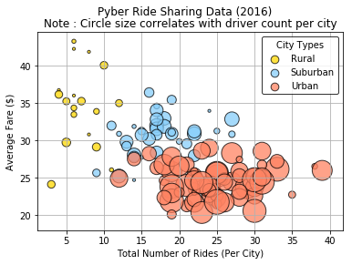
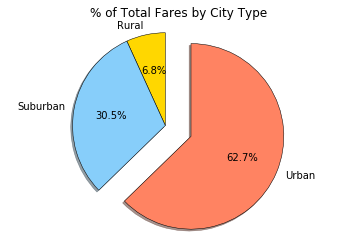
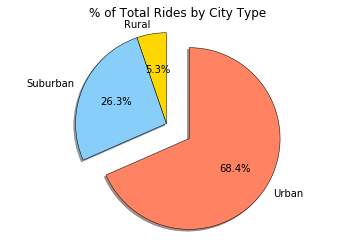
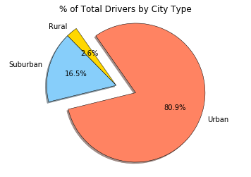

```python
%matplotlib inline

# Dependencies and Setup
import matplotlib.pyplot as plt
import pandas as pd
import numpy as np

# File to Load (Remember to change these)
city_data_to_load = "data/city_data.csv"
ride_data_to_load = "data/ride_data.csv"

# Read the City and Ride Data
city_data_pd = pd.read_csv(city_data_to_load)
ride_data_pd = pd.read_csv(ride_data_to_load)

# Combine the data into a single dataset
city_data_pd = city_data_pd.drop_duplicates('city', keep = 'first')
city_ride_data_pd =  city_data_pd.merge(ride_data_pd, on = 'city')

# Display the data table for preview
city_ride_data_pd.head()
```
<table border="1" class="dataframe">
  <thead>
    <tr style="text-align: right;">
      <th></th>
      <th>city</th>
      <th>driver_count</th>
      <th>type</th>
      <th>date</th>
      <th>fare</th>
      <th>ride_id</th>
    </tr>
  </thead>
  <tbody>
    <tr>
      <th>0</th>
      <td>Richardfort</td>
      <td>38</td>
      <td>Urban</td>
      <td>2018-02-24 08:40:38</td>
      <td>13.93</td>
      <td>5628545007794</td>
    </tr>
    <tr>
      <th>1</th>
      <td>Richardfort</td>
      <td>38</td>
      <td>Urban</td>
      <td>2018-02-13 12:46:07</td>
      <td>14.00</td>
      <td>910050116494</td>
    </tr>
    <tr>
      <th>2</th>
      <td>Richardfort</td>
      <td>38</td>
      <td>Urban</td>
      <td>2018-02-16 13:52:19</td>
      <td>17.92</td>
      <td>820639054416</td>
    </tr>
    <tr>
      <th>3</th>
      <td>Richardfort</td>
      <td>38</td>
      <td>Urban</td>
      <td>2018-02-01 20:18:28</td>
      <td>10.26</td>
      <td>9554935945413</td>
    </tr>
    <tr>
      <th>4</th>
      <td>Richardfort</td>
      <td>38</td>
      <td>Urban</td>
      <td>2018-04-17 02:26:37</td>
      <td>23.00</td>
      <td>720020655850</td>
    </tr>
  </tbody>
</table>
</div>


## Bubble Plot of Ride Sharing Data


```python
# Obtain the x and y coordinates for each of the three city types

# Group the dataframe by city
city_ride_data_by_city = city_ride_data_pd.groupby('city')

# Average fare by city
avg_fare_by_city = city_ride_data_by_city.mean()['fare']

# No. of rides by city
ride_count_by_city = city_ride_data_by_city['ride_id'].count()

# No. of drivers by city
driver_count_by_city = city_ride_data_by_city.mean()['driver_count']

# Set the index by type of city
city_type = city_data_pd.set_index('city')['type']

# Make a DataFrame with all the values
city_info = pd.DataFrame({
    "Number of Rides": ride_count_by_city,
    "Average Fare": avg_fare_by_city,
    "Number of Drivers": driver_count_by_city,
    "Type of City": city_type
})

city_info.sort_values('Number of Drivers', ascending = False)

# Build the scatter plots for each city types
rural = city_info[city_info['Type of City'] == 'Rural']
suburban = city_info[city_info['Type of City'] == 'Suburban']
urban = city_info[city_info['Type of City'] == 'Urban']

# Color Scheme for Bubble Plot
color_scheme = {'Gold':'#FFD700', 'Light Sky Blue':'#87CEFA', 'Coral':'#FF8362'}

city_color = {'Urban': color_scheme['Coral'], 'Suburban': color_scheme['Light Sky Blue'], 'Rural': color_scheme['Gold']}

plt.suptitle('Pyber Ride Sharing Data (2016)')

plt.scatter(rural['Number of Rides'], rural['Average Fare'], s = rural['Number of Drivers']*10, color = city_color['Rural'], edgecolor = 'black', label = 'Rural', alpha = .75)
plt.scatter(suburban['Number of Rides'], suburban['Average Fare'], s = suburban['Number of Drivers']*10, color = city_color['Suburban'], edgecolor = 'black', label = 'Suburban', alpha = .75)
plt.scatter(urban['Number of Rides'], urban['Average Fare'], s = urban['Number of Drivers']*10, color = city_color['Urban'], edgecolor = 'black', label = 'Urban', alpha = .75)

plt.title('Note : Circle size correlates with driver count per city')
plt.xlabel('Total Number of Rides (Per City)')
plt.ylabel('Average Fare ($)')

# Create a legend
lgnd = plt.legend(frameon = True, title = "City Types", edgecolor = 'black')
lgnd.legendHandles[0]._sizes = [75]
lgnd.legendHandles[1]._sizes = [75]
lgnd.legendHandles[2]._sizes = [75]

# Show the gird
plt.grid()

# Save Figure
plt.savefig('bubbleplot.png')
```





## Total Fares by City Type


```python
# Calculate Type Percents
city_ride_data_by_type = city_ride_data_pd.groupby('type')['type', 'fare', 'ride_id', 'driver_count']

sum_of_fares = city_ride_data_by_type.sum()['fare']

# Build Pie Chart
labels = sum_of_fares.index

colors = [city_color[n] for n in labels]
explode = [0 , 0, .3]
plt.pie(sum_of_fares, startangle = 90, colors = colors, explode = explode, labels = labels, autopct = "%1.1f%%", shadow = True, wedgeprops = {'linewidth': .5, 'edgecolor': 'black'})

plt.title('% of Total Fares by City Type')
plt.axis('equal')

# Save Figure
plt.savefig("Pie Charts/total_fares_percent_by_city.png")

# Display the chart
plt.show()
```





## Total Rides by City Type


```python
# Calculate Ride Percents
total_rides_by_city = city_ride_data_by_type.count()['ride_id']

# Build Pie Chart
labels = total_rides_by_city.index
plt.pie(total_rides_by_city, startangle = 90, explode = explode, colors = colors, labels = labels, autopct = "%1.1f%%", shadow = True, wedgeprops = {'linewidth': .5, 'edgecolor': 'black'})
plt.title('% of Total Rides by City Type')
plt.axis('equal')

# Save Figure
plt.savefig("Pie Charts/total_rides_percent_by_city.png")

# Display the chart
plt.show()
```





## Total Drivers by City Type


```python
# Calculate Driver Percents
total_drivers_by_city = city_data_pd.groupby('type').sum()['driver_count']

# Build Pie Charts
labels = ['Rural', 'Suburban', 'Urban']
plt.pie(total_drivers_by_city, startangle = 125, explode = explode, colors = colors, labels = labels, autopct = "%1.1f%%", shadow = True, wedgeprops = {'linewidth': .5, 'edgecolor': 'black'})
plt.title('% of Total Drivers by City Type')
plt.axis('equal')

# Save Figure
plt.savefig("Pie Charts/total_drivers_percent_by_city.png")

# Display the chart
plt.show()
```




